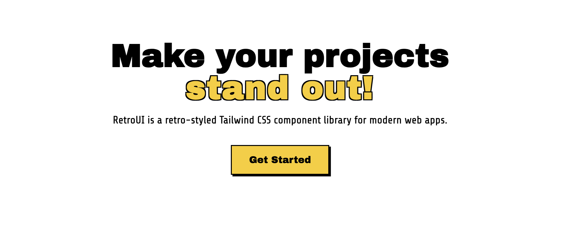

# Retro UI
RetroUI is a retro-styled Tailwind CSS component library for modern web apps.

## Why another UI library?
<iframe width="560" height="315" src="https://www.youtube.com/embed/7goHwy6k3gU?si=ujdg4aRfEPpVuXJ5" title="YouTube video player" frameborder="0" allow="accelerometer; autoplay; clipboard-write; encrypted-media; gyroscope; picture-in-picture; web-share" referrerpolicy="strict-origin-when-cross-origin" allowfullscreen></iframe>

### [Documentation](https://ui.ariflogs.com/components)
### [Contributing Guide](./CONTRIBUTING.md)

## License
RetroUI Core Version is Free and open-source, both for your personal or commercial projects.